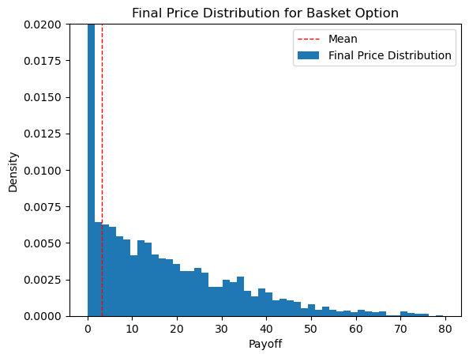

# Basket-Option-Pricing

*Original project done as part of MATH-GA - 2048. All rights reserved.*

## Basket Options

A basket (put or call) option is an option on a basket of securities, commodities, or currencies (it is similar to an option on index).

Who uses basket options?

* Multinational corporations that want to hedge against a number of FX risks.
* Investors who wish to have a broad exposure to (or hedge) particular portfolios, industry sectors, or countries.

Index options are an alternative to basket options, but if the index does not match the desired portfolio there will be significant tracking error risk that can cost more than the additional cost of the basket option. Another alternative is a collection of individual stock options, but this may be more expensive due to transaction costs and because the implied volatility of each option includes a large component of specific stock risk which may be diversified in a basket.

The discounted payoff function is given by:

$$
V_{\text{basket}} =
e^{-rT} \left( \sum_i^m w_i S_i(T) - K \right)^+
$$

where $S_i(t)$ is the asset value at time $t$ of asset $i$, $m$ is the number of assets in the basket, $w_i$ is the weight of asset $i$ in the basket (which does not change over time), $K$ is the strike price, $r$ is the risk-free rate, and $T$ is the time to maturity.

## Problem 

Let's assume we have a client that wants to protect their portfolio of tech stocks for the next year by purchasing an at-the-money basket put option on the five stocks in the portfolio (IBM, NFLX, MSFT, FB, and AAPL), where the stocks are equally-weighted.

Let's, using Monte-Carlo, compute the price (along with the estimated error) of the basket option for the client.

We assume that the risk-free rate is 2% and use the last year of daily prices to compute the correlation matrix.

## Results

We first extract correlations for the stocks considered using the Yahoo finance API.

*Correlation Matrix*

          AAPL       IBM      META      MSFT      NFLX
    AAPL  1.000000  0.124659  0.428870  0.699263  0.361198
    IBM   0.124659  1.000000  0.057525  0.035345 -0.160987
    META  0.428870  0.057525  1.000000  0.534275  0.437277
    MSFT  0.699263  0.035345  0.534275  1.000000  0.447017
    NFLX  0.361198 -0.160987  0.437277  0.447017  1.000000

*Drifts and Volatilities*

    AAPL       IBM        META       MSFT       NFLX
    0.33077031 0.14548014 -0.1872555 0.25826474 -0.27459323
    0.24219112 0.21048039 0.40930979 0.22691955 0.3942563

We can then simulate each stock individually using correlated geometric brownian motion and find the price of the basket option using Monte Carlo simulation.

The `corr_brownian` function simulates the correlated geometric Brownian motions for multiple assets over a given time horizon using the Euler-Maruyama method for discretization. The Geometric Brownian Motion (GBM) is defined by the following stochastic differential equation (SDE):

$$ dS_t = \mu S_t dt + \sigma S_t dW_t $$

where:

* $S_t$ is the stock price at time $t$,
* $\mu$ is the drift rate,
* $\sigma$ is the volatility,
* $dW_t$ is a standard Wiener process.

The correlations among the assets are handled using the Cholesky decomposition of the correlation matrix, $\text{corr}$, to obtain correlated Brownian motions $dW_t$. The correlated standard normal variables are generated as:

$$ Z_{\text{corr}} = \text{Chol}(\text{corr}) \cdot Z $$

where $Z$ is a matrix of standard normal random variables.

The discretized version of the GBM used in the function is obtained from the Euler-Maruyama method, and is given by:

$$S_{t+dt} = S_t \cdot \exp\left( \left(\mu - \frac{1}{2} \sigma^2 \right) dt + \sigma \sqrt{dt} \cdot Z_{\text{corr}} \right)$$

Now, we can proceed to the Monte Carlo simulation.

1. **Initial Setting**:
   * Set the initial asset prices $S_0$, weights $w$, and other parameters like drifts $\mu$, volatilities $\sigma$, correlation matrix $\text{corr}$, and time parameters $T$ and $dt$.
   * Set $N = 10000$ to be the number of Monte Carlo simulations.
   * Create an array `prices` to store the simulated prices of the assets.

2. **Asset Price Simulation**:
   * Utilize the `corr_brownian` function to simulate the asset prices based on the correlated geometric Brownian motions for each simulation iteration.
   * Store the final simulated prices of the assets in the `prices` array.

3. **Basket Strike Price Calculation**:
   * For the strike price $K$ of the basket option we use the dot product of the initial asset prices $S_0$ and the weights vector $w$:

$$K = S_0 \cdot w$$

4. **Payoff Calculation**:
   * For each simulation, calculate the payoff of the basket put option as:

$$ \text{payoff} = \max(K - w \cdot S, 0) $$

where $S$ is the vector of asset prices at the end of the simulation.

5. **Option Price Estimation**:
   * Calculate the price of the basket put option by taking the average of the payoffs from all the simulations, discounted back to the present value using the risk-free rate $r = 0.02$:

$$\text{Option Price} = e^{-rT} \times \frac{1}{N} \sum_{i=1}^{N} \text{payoff}_i$$

6. **Error Estimation**:
   * Estimate the error in the simulation as the standard error of the mean of the payoff:

$$\text{Option Error} = \frac{\text{std}(\text{payoff})}{\sqrt{N}}$$

Here we display the payoffs for each path of the Monte Carlo simulation ($\text{payoff}_i$):

The mean corresponds to the price of the option before discounting (y-axis has been troncated for clarity).

The final result is:  

$$\text{Basket Option Price} = 3.21 \pm 0.1$$

The final price is based on historical data between 2022-03-05 and 2023-03-05.
The results of this project can easily be generalized to any number of assets with any weights.

